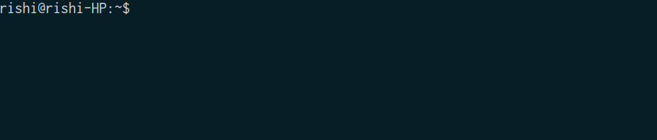

# current-time-cli

[](https://travis-ci.org/CodeDotJS/current-time-cli)

> A CLI tool to find current time in descriptive format.

<p align="center">
	
</p>

## Install

```
$ npm install --global current-time-cli
```
__`OR`__
```
$ sudo npm install --global current-time-cli
```

## Usage

```
$ currt

› Please provide a query

	For help       :   currt -h, --help

	For examples   :   currt -e, --examples
```

## Related

- [current-time](https://github.com/CodeDotJS/current-time) : API for this tool.

## License

MIT © [Rishi Giri](https://github.com/CodeDotJS)
